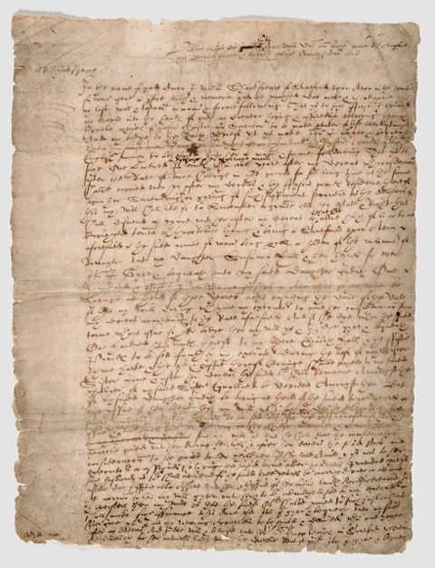

EX5: Deep Learning
==================

RNN Based Text Generator
------------------------

Our goal is to build and train a model which will be able to predict the next word.

Our Data is Shakespeare's Will play .csv file.

**Steps**
  1. Text tokenization using pythons nltk library
  2. Add our special tokens
  3. Mapping words to vectors (words to indexes and vice versa)
  4. Initialize RNN using pythons numpy library
  5. Perdict words probabilities
  6. Train model using [sgd steps](http://scikit-learn.org/stable/modules/sgd.html)
  7. Generate sentences
  
  
**How can we improve the process?**
  1. Remove unnecessary words (replacing uncommon or rare words with special tokens)
  
**Training**  

We've tried training the model using the RNN class but it took too much time. Instead, we've used the RNNTHEANO class  
which we've found online. RNNTHEANO uses the GPU (instead of numpy calculations) which makes the traning much faster.
In addition, we've used AWS EC2 instances in order to train the model. We've used a free instance t2.micro which took us a while.
We can get much better results with more training using g2.xlarge for example.
  
**Results**
   * 2.1.96 saying whoreson worst
   * 4.1.35 I will and sends me word
   * 1.2.65 act which own proper single prayers prince
   * 5.2.31 monster purpose
   * 1.2.19 happy instruments did florence number
   * 1.2.57 meat crown I prithee, trouble me
   * 2.2.23 crown shape
   * 2.1.21 beating disposed
   * 3.2.1 beloved lord
   * 2.2.62 meet at supper

Our results are not pure shakespeare monologues but you can definetely see that there's logic and you can also sense the  
medieval english language.
We can surely say that the results depend on the training time. If the traning was be longer,  
we could've got much better results (more sgd steps/iterations).

**Challenges**
   1. Using AWS
   2. Training with basic RNN (we gave up on that because it was too long, used theano instead).  

